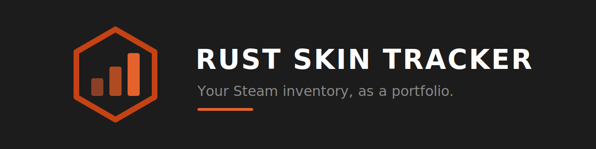
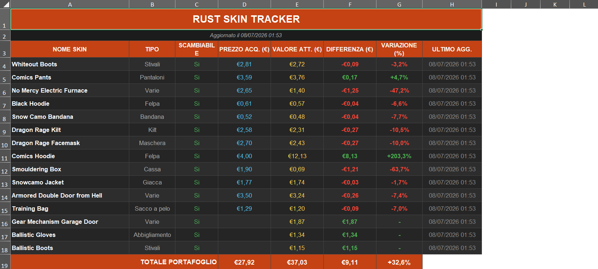

<p align="center">
  
</p>

<p align="center">
  <a href="https://github.com/Ri1ckkk/Rust-skin-tracker/releases/latest"></a>
  <a href="https://github.com/Ri1ckkk/Rust-skin-tracker/releases"></a>
  
  <a href="LICENSE"></a>
  <a href="https://buymeacoffee.com/ri1ckkk"></a>
</p>

Turn your Steam inventory into an Excel portfolio: current market value, your purchase price, and profit/loss per skin.

Most Rust inventory calculators tell you what your skins are worth *today*. This one tracks what you **paid** and what you've **made** — and it keeps your buy prices when you re-run it.

> Not affiliated with Valve Corporation or Facepunch Studios.

---

## Download

**[⬇ Download RustSkinTracker.exe](https://github.com/Ri1ckkk/Rust-skin-tracker/releases/latest)** — no Python, no install. Put it in its own folder and double-click.

On first run it asks for your SteamID64 and saves it to `config.json` next to the executable. The spreadsheet is written to the same folder.

Windows SmartScreen will say the publisher is unknown, because the binary isn't code-signed. Click **More info → Run anyway**, or [build it yourself from source](#run-from-source). Every release is compiled by GitHub Actions straight from the tagged commit — you can check the build log yourself.

---

## Screenshot

<p align="center">
  
</p>

---

## What you get

An `.xlsx` file with two sheets:

**Inventory** — one row per skin: name, type, quantity, tradable, buy price, current value, difference, % change.

**Summary** — total invested, current value, total P/L, return %, how many skins are up vs down.

Enter your buy prices once in column E. Every re-run refreshes market prices and leaves your numbers alone. Skins you haven't priced yet show a `-` and stay out of the P/L, so the totals never lie to you.

---

## Requirements

- A **public** Steam inventory (Steam → Settings → Privacy → Inventory: Public)
- That's it, if you use the `.exe`. Python 3.9+ if you run from source.

## Run from source

```bash
git clone https://github.com/Ri1ckkk/Rust-skin-tracker.git
cd Rust-skin-tracker
pip install -r requirements.txt
python rust_tracker.py
```

Don't know your SteamID64? Paste your profile URL when asked, or look it up at [steamid.io](https://steamid.io).

## Configuration

Copy `config.example.json` to `config.json` and edit:

| Key | Default | Notes |
|---|---|---|
| `steam_id` | `""` | Your SteamID64 (17 digits) |
| `currency` | `3` | Steam currency code — 1 = USD, 2 = GBP, 3 = EUR, 23 = CAD, 24 = AUD |
| `language` | `"en"` | `"en"` or `"it"` — sheet headers and item types |
| `output_file` | `rust_skin_tracker.xlsx` | Where the spreadsheet goes |
| `request_delay` | `1.2` | Seconds between Steam requests. See below. |

`config.json` is gitignored — your Steam ID stays local.

---

## About rate limits

Steam limits inventory and market requests **per IP address**. Push too hard and you get `429 Too Many Requests`, which can lock you out for hours.

`request_delay: 1.2` is deliberately conservative. A 60-skin inventory takes about 90 seconds. Lowering it below `1.0` is asking for a ban. The script backs off automatically when it sees a 429, but the best strategy is not to trigger one.

Prices come from Steam's `priceoverview` endpoint (lowest listing, falling back to median). Skins with no active listings show up as `N/A`.

---

## Known limits

- Only **marketable** items are included. Items you can't sell have no market price.
- Steam's `priceoverview` returns the *lowest ask*, not what you'd actually net after Steam's ~15% fee.
- Third-party marketplaces (Skinport, DMarket, etc.) often price differently. This tool only reads Steam.
- Close the spreadsheet before re-running, or Windows won't let the tool overwrite it.

---

## Support

If this saved you time, you can [buy me a coffee](https://buymeacoffee.com/Ri1ckkk) — completely optional, and the tool will always be free. ☕

Bug reports and pull requests welcome.

---

## Author

Built by [**Ri1ckkk**](https://github.com/Ri1ckkk).

## License

MIT — see [LICENSE](LICENSE).
